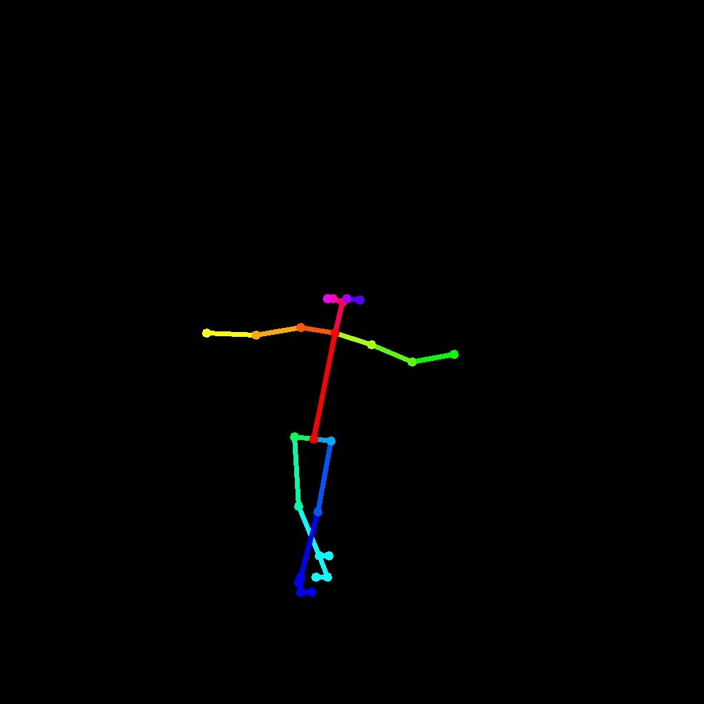
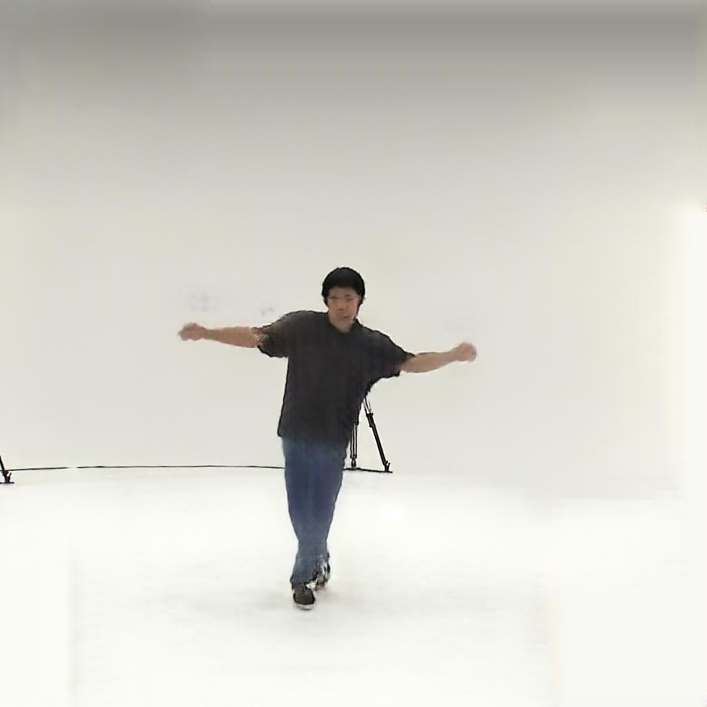

# Pose-Guided Human Synthesis with Generative AI


<p align="center">
  
  
  
  
</p>

<p align="center">
  A full-stack project for real-time, pose-guided human image synthesis, built on <strong>NVIDIA's pix2pixHD</strong> and served through a user-friendly web interface.
</p>

> **Note**: This repository extends the original <a href="https://github.com/NVIDIA/pix2pixHD">NVIDIA/pix2pixHD</a> with a custom-trained model and a Flask web app for demonstration purposes.

---

## 📸 Demo

Draw a skeletal pose on the canvas and generate a photorealistic human figure in real-time.

| Input (User-Drawn Skeleton) | Output (Synthesized Image) |
| :-------------------------: | :--------------------------: |
|     |    |

---

## 🛠️ Getting Started

### 1. Clone & Setup Environment
```bash
# Clone the repository
git clone https://github.com/qwerty1729-ind/Generative-AI-Pose-Guided-Human-Synthesis
cd Generative-AI-Pose-Guided-Human-Synthesis

# Create and activate a virtual environment
python -m venv venv
# Windows: venv\Scripts\activate | macOS/Linux: source venv/bin/activate

# Install dependencies
pip install -r requirements.txt
```

### 2. Download Model Weights
The custom model weights are required to run the synthesis.

🔗 **[Download 'p19' Model Weights Here](https://iitk-my.sharepoint.com/:f:/g/personal/manemonip23_iitk_ac_in/EoNQx_53ZqFMjFQp-pt7b4IBTRSzukpC8Gp8AHjhhjvcxw?e=ThDUxo)**

After downloading, extract the contents into `pix2pixHD/trained/`:
```bash
pix2pixHD/trained/p19/latest_net_G.pth
```

### 3. Run the App
```bash
cd app
python app.py
```
Then open `http://127.0.0.1:5000` in your browser to interact with the canvas.

---

## 📜 License & Acknowledgments

- The core pix2pixHD codebase is under the [original NVIDIA License](LICENSE).
- **Base Model:** [NVIDIA/pix2pixHD](https://github.com/NVIDIA/pix2pixHD)
- **Project Development:** [qwerty1729-ind](https://github.com/qwerty1729-ind) — Flask UI, normalization, integration, training setup.

---
